# Appium Desktop

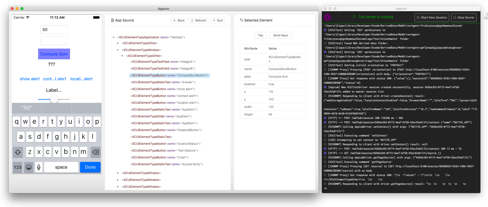

Appium Desktop is a suite of apps for Mac, Windows, and Linux which gives you the power of the [Appium](http://appium.io) automation server in a beautiful and flexible UI. It is a combination of a few Appium-related tools:

* A graphical interface for the Appium Server. You can set options, start/stop the server, see logs, etc... You also don't need to use Node/NPM to install Appium, as the Node runtime comes bundled with Appium Desktop.
* An Inspector that you can use to look at your app's elements (Safari/Chrome browser, native or hybrid app), get basic information about them, and perform basic interactions with them. This is useful as a way to learn about Appium or as a way to learn about your app so you can write tests for it.

## Download Appium Desktop

You can always pick up the latest release of the Server GUI or the Inspector at our
[Release](https://github.com/appium/appium-desktop/releases/latest) page on
GitHub.

If you're on Windows or macOS, Appium Desktop will automatically provide you
with updated versions of the app when they are released. If you encounter
a problem updating, simply delete or uninstall the app and re-download the
latest from the link above.

Note that Appium Desktop _is not_ the same thing as Appium. Appium Desktop is
a graphical frontend to Appium with additional tools. Appium Desktop is
released on its own cadence and has its own versioning system. If you are
reporting an issue with Appium Desktop, always be sure to include _both_ the
version of Appium Desktop and the version of the Appium Server which is in use
(see below).

If you're on macOS, you will need to install Appium Desktop apps by copying the app
from the downloaded DMG file to your own file system (the best place is the
"Applications" folder). Running Appium from in side the attached DMG itself is
not supported, and will not work.

## Known Issues
* Some Windows 10 Users experience a `PathTooLongException` when installing the EXE. The workaround for this is to update the setting on Windows to [enable long paths](https://superuser.com/questions/1119883/windows-10-enable-ntfs-long-paths-policy-option-missing)

## Usage Instructions

These instructions assume you are already familiar with Appium and Appium-related concepts. If you
are new to Appium, please visit [appium.io](http://appium.io) and read our introductory material.
They also assume that you have downloaded both the Server GUI and the Inspector apps.

This app provides a convenient way to download and run the Appium automation
server, as well as a tool for inspecting elements in Chrome/Safari browser and your Android or iOS application. Its
various capabilities are described in the following sections.

### The Appium Desktop Server GUI

#### Starting a simple server

When you open Appium Desktop, you are greeted with the server start window. The
basic option is to start an Appium server with all its defaults and the ability
to modify the host and port. The start button will also let you know which
version of the Appium server you are running, which can be useful when
reporting issues to the Appium team.

#### Starting a server with advanced options

By clicking on the 'Advanced' tab, you have the ability to set all the server
flags that are available in Appium. This is for advanced users and should only
be modified after consulting the Appium documentation.

#### Server presets

If you use the advanced server options, you have the ability to save
a configuration for later use. Simply save the preset on the 'Advanced' tab,
and you will subsequently be able to recall and start the server with that
configuration from the 'Preset' tab.

### The server console output window

Once you start the server, it will launch on the host and port you specified,
and open a new window displaying the server log output.

This is fairly straightforward and no real interaction is possible, beyond
using the button to stop the server. You can also copy-and-paste the logs from
this window which is useful in reporting Appium issues.

### The Appium Desktop Inspector

The Inspector opens up with a New Session windows. This New Session window allows you to construct
a set of Appium desired capabilities used to launch an Appium session. You can launch a session
against the currently-running Appium CLI or Appium Server GUI server, or you can launch a session
against a variety of other endpoints. Simply include the connection details for any server that you
wish to connect to.

**IMPORTANT:** to ensure that the Inspector can talk to your Appium server, any Appium server you
connect to from the Inspector may need to be started with the `--allow-cors` flag, so that
Chrome/Electron's content security policies don't prevent the Inspector from making requests to the
server (which may be running on a different host and port). If you get immediate errors when
talking to your Appium server, ensure that this setting is configured on your server.

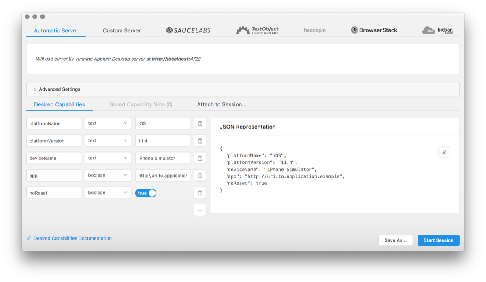

You can add available cloud providers as new tabs.
When you select _Select Cloud Providers_ tab on the view,
_Select Cloud Providers_ dialog appears.
You can select some of them and click _Done_, they will appear on
the _New session window_ as tabs.

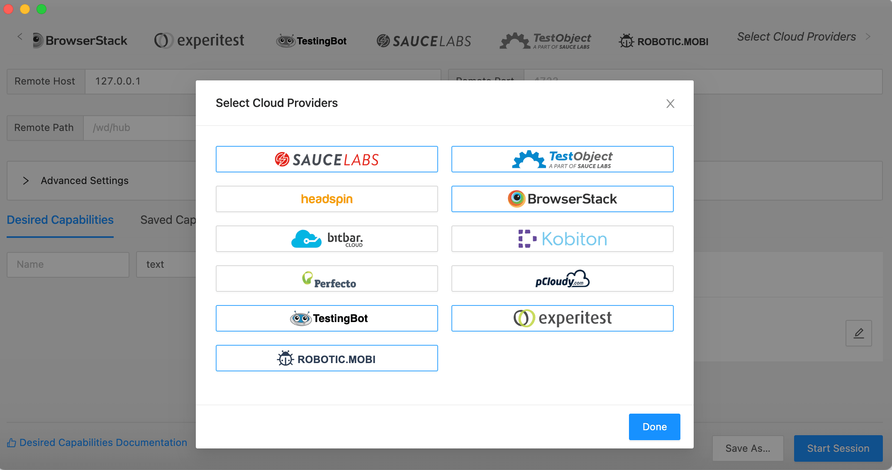

#### Appium Endpoints

These are the options for launching a session against a non-local Appium server:

|     Endpoint     |                                                        Description                                                         |
| ---------------- | -------------------------------------------------------------------------------------------------------------------------- |
| Automatic server | Automatically utilizes the currently-running Appium server                                                                 |
| Custom Server    | Launch a session on an Appium server running on another machine over the network                                           |
| Sauce Labs       | Launch a session on the [Sauce Labs](https://saucelabs.com) cloud. [Documentation](https://wiki.saucelabs.com/)            |
| TestObject       | Launch a session on the [TestObject](https://testobject.com) cloud. [Documentation](https://wiki.saucelabs.com/)           |
| Headspin         | Launch a session on the [Headspin](https://headspin.io) cloud. [Documentation](https://headspin.io/)                 |
| BrowserStack     | Launch a session on the [Browserstack](https://browserstack.com) cloud. [Documentation](https://www.browserstack.com/docs) |
| Bitbar           | Launch a session on the [Bitbar](https://bitbar.com) cloud. [Documentation](http://docs.bitbar.com/)                       |
| Kobiton           | Launch a session on the [Kobiton](https://kobiton.com) cloud. [Documentation](https://docs.kobiton.com/)                       |
| Perfecto         | Launch a session on the [Perfecto](https://www.perfecto.io) cloud. [Documentation](https://developers.perfectomobile.com/display/PD/Appium) |
| Pcloudy         | Launch a session on the [Pcloudy](https://www.pcloudy.com) cloud. [Documentation](https://www.pcloudy.com/mobile-application-testing-documentation) |
| TestingBot       | Launch a session on the [TestingBot](https://testingbot.com) cloud. [Documentation](https://testingbot.com/support) |
| Experitest       | Launch a session on the [Experitest](http://www.experitest.com) cloud. [Documentation](https://docs.experitest.com/display/TE/Appium) |

It should be straightforward to get set up with any of these options. Simply
enter your details in the input fields provided.

#### Desired Capabilities

Desired capabilities are how you configure your Appium session. They tell the
Appium server what kind of platform and app you want to automate. If you are
unfamiliar with the concept of desired capabilities, or which desired
capabilities are required to launch Appium sessions of various types, you
should consult the Appium documentation. Additionally, if you're using one of
the cloud providers, consult their documentation for possible vendor-specific
details.

Appium Desktop does not restrict your creation of desired capabilities in any
way, nor will it validate them for you. It simply provides a nice UI for
entering them in, and saving them for later use. Under the 'Desired
Capabilities' tab, you can use the form fields and '+' button to enter as many
desired capabilities as you need. You will also see a representation of the
resulting JSON, which is what is actually sent to the Appium server. This can
be useful for verifying your capabilities, or for copy-and-pasting when
reporting issues.

Once you have set your desired capabilities, you might wish to save them so you
can run the same type of session later. Simply click the 'Save As...' button to
give your capability set a name. You can then access it under the 'Saved
Capability Sets' tab, for later editing or session launching.

Once your server type and capabilities are set, click 'Start Session' to launch
the Appium Desktop Inspector.

#### Attach to an Existing Session

If you click on the "Attach to Session..." tab, you can select an existing
session from a list of currently running sessions on your selected server, or you
can input a session ID of a currently-running session.  That session should be
running on the server details you specified in the server type section above.
Attaching to an existing session is possible because the Inspector is just an
Appium client. This could be useful if you want to debug the middle of a running
test. When you quit the Inspector window of an existing session, Appium Desktop
will not quit the session as it does normally.

### The Inspector

The Inspector is a visual representation of the state of your application along
with the ability to perform certain interactions in your application through
Appium.

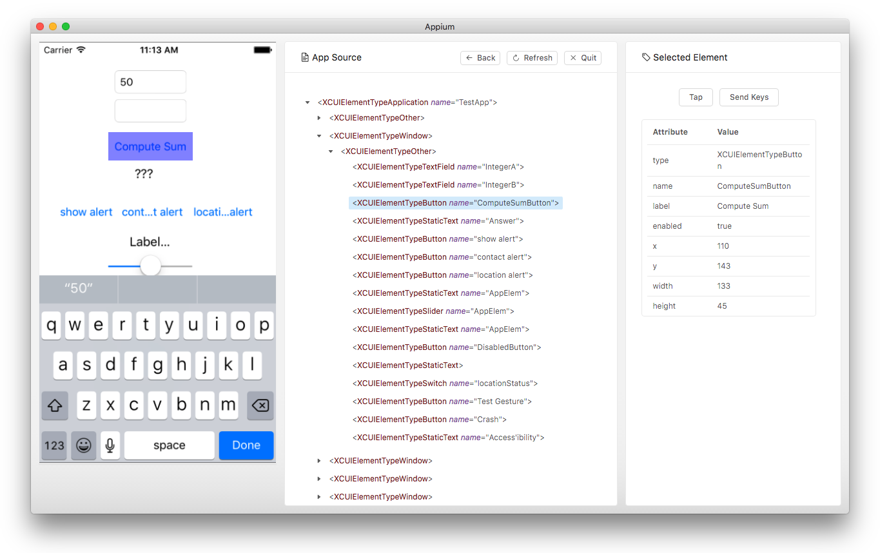

Appium sessions can take some time to load, especially on cloud services, so
please be patient. When the session loads, a screenshot of your app will appear
on the left. You can mouse over various UI elements in your application, and
see them highlighted.

In the middle of the Inspector window is your app's hierarchy, represented as
XML. You can navigate this tree by clicking through it, or by clicking on
elements in the screenshot view. They will then be highlighted.

When an element is highlighted, its information will appear in the detail view
on the right side of the Inspector. This detail view consists of potential
actions to take against the element, and a table of the element's properties.
These properties are valuable in determining how the element might accessed
using a particular Appium locator strategy. With an element selected, you can
also 'Tap' the element, or 'Send Keys' to the element (if it is a text field).

When you take such an action with an element, the Inspector will send the
command to Appium, which will execute it. If the action is successful, a new
screenshot will be generated and you should see the updated state and XML of
your app. If it's not successful, you'll have an opportunity to see the error
message.

The top of the Inspector window contains a small toolbar with icons
representing the ability to take certain actions in the Inspector:

* Back (call `driver.back`)
* Refresh (refresh the source and screenshot)
* Start Recording (open the recorder, see the next section for more information on the recorder)
* Quit the session (call `driver.quit` and close the Inspector)

#### The inspector for Hybrid or Web apps
Appium Desktop can also inspect the Webview of your Hybrid app or inspect elements in the Chrome of Safari browser.
It will automatically determine for Android or iOS if a webview is detected and will notify you about this in the right part of the screen.

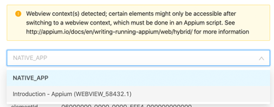

A select box of all found contexts will be shown and after selecting a context the source will be updated and show the source.
The below screenshot shows the HTML source of the Appium Desktop documentation website

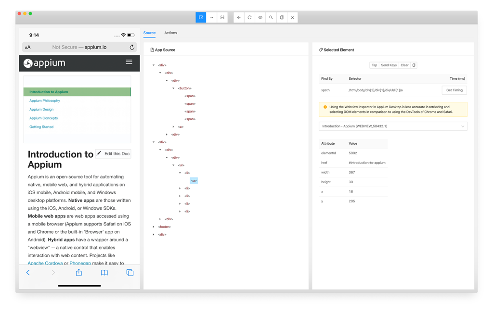.

As of Appium Desktop version [`1.18.0`](https://github.com/appium/appium-desktop/releases/) it will automatically enable showing the HTML-source if a Chrome or Safari session is started.

#### More selector options
XML is not a native programming language for iOS as it is with Android. Appium will automatically translate the iOS-UIHierarchy into XML, but this is a time-consuming process.
The XML will be used to provide a XPATH that can be used to find elements. When you use that XPATH selector with iOS during automation, Appium always needs to do the translation which will slow down the test execution (for more info see [Appium Pro newsletter 8](https://appiumpro.com/editions/8-how-to-find-elements-in-ios-not-by-xpath)).

As of Appium Desktop version [`1.18.0`](https://github.com/appium/appium-desktop/releases/) it will, if possible, also provide the:

- [`-ios predicate string`](https://github.com/facebookarchive/WebDriverAgent/wiki/Predicate-Queries-Construction-Rules)
- [`-ios class chain`](https://github.com/facebookarchive/WebDriverAgent/wiki/Class-Chain-Queries-Construction-Rules)

selector options together with a *Get Timing* button.

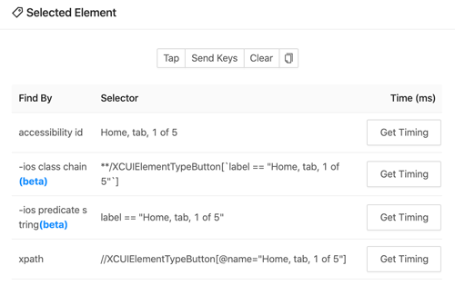.

When you select an iOS element in Appium Desktop and press the *Get Timing*-button it will provide you the time in milliseconds
it will take per selector to find the element and will automatically sort them from fast to the slowest.
In most cases you will see that XPATH is the slowest locator strategy in comparison to the other options.

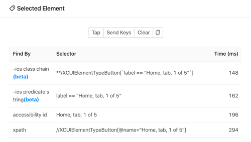.

### The Recorder

Appium Desktop comes with a very basic action recorder, that watches for
actions taken using Appium Desktop and displays language-and-framework-specific
code that represents those actions. The code can then be copied-and-pasted into
the appropriate Appium client code and used for tests.

**NB:** the goal of the Recorder is not to produce production-ready test code.
It is designed as a tool to help explore the Appium API, and demonstrate how
certain automation behaviors correspond to method calls in a particular
language and Appium library. In sum, it is a learning tool, not a robust code
generation feature, and should be used as such.

When you start recording, the Inspector will show an additional window:

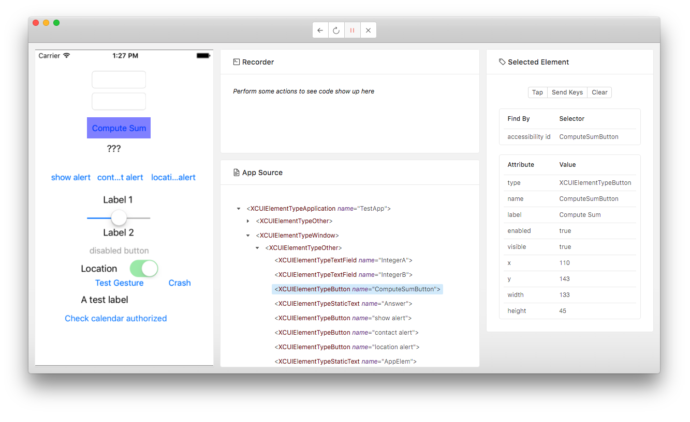

At first, the Recorder will show no code. You will first have to take some
action, like finding an element in the hierarchy and tapping on it, or sending
keystrokes to it. When you do this, code will appear in the recorder window,
corresponding to the particular language and framework you have chosen (which
can be adjusted in the drop-down menu at the top right of the Recorder):

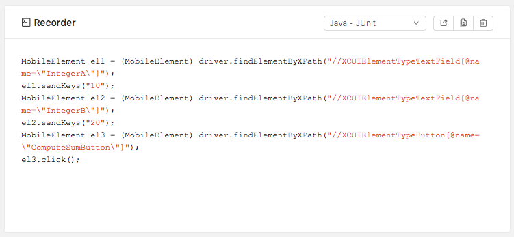

This code can be copied to your clipboard using the appropriate button at the
top right of the Recorder pane. Note that by default what is shown are simply
lines of code corresponding to the specific actions you have taken while
recording---in general you cannot paste these lines into an empty text file and
run the code. To run Appium test scripts in code requires that various
dependencies (like the Appium client libraries) be installed, and that script
boilerplate (like instantiating a driver and initializing a session) be
present. To show this additional code, you can click the "Show Boilerplate"
button. With boilerplate code shown, it is possible to copy and paste the code
into a new file and run it.

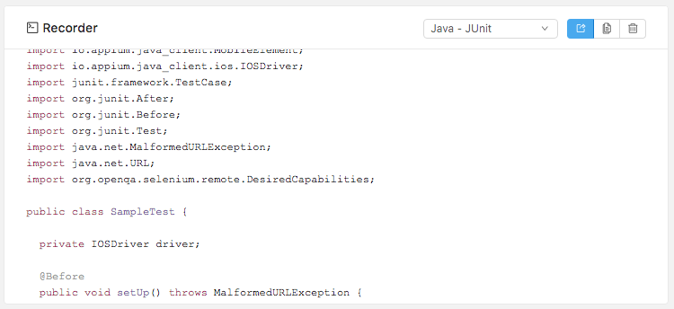

The power of the Recorder will continue to grow as we add more languages,
frameworks, and actions to Appium Desktop.

### Conclusion

This is everything you need to know to use Appium Desktop successfully!
Remember, Appium Desktop is not a replacement for understanding Appium
itself---it is simply a convenient tool for working with Appium on your
desktop, and an Inspector for exploring your app. Have fun!

## Reporting Issues and Requesting Features

Appium Desktop is open source, and we use GitHub for issue tracking. Please
simply report issues at our [issue
tracker](https://github.com/appium/appium-desktop/issues). We will endeavor to
determine whether the issue you are reporting is related to Appium Desktop or
Appium Server. If it's not related to Appium Desktop specifically, we will
close the issue and ask you to open a general Appium issue at [Appium's main
issue tracker](https://github.com/appium/appium/issues). Please, save
yourselves and us valuable time by getting clear on whether the issue you're
experiencing is related to Appium Desktop specifically or instead is a general
Appium issue. You can do this by seeing whether the issue reproduces with the
Appium command line server as well. If it does, direct your report to Appium's
issue tracker.

Have a feature request? Follow the same process and submit an issue to the
appropriate tracker! (Either here in this repo if the request is specifically
for Appium Desktop, or Appium's main tracker if the request is for Appium more
generally.)

## Advanced Topics and Troubleshooting

#### Connect to local Appium server

Appium Desktop has own Appium CLI. You can launch it via [Starting a simple server](#starting-a-simple-server).
But sometimes you need another Appium version which is bundled in the desktop.
For example, when you want to use Appium beta.

Then, please follow below steps.

1. Build Appium CLI environment: [Getting Started](http://appium.io/docs/en/about-appium/getting-started/)
    - e.g., `$ npm install -g appium@1.14.0`
2. Launch the Appium
    - `$ appium`
3. Launch Appium Desktop and open [The New Session window](#the-new-session-window)
4. Connect to the running Appium server as `Custom Server` as below (by default)
    - Remote Host: `localhost`
    - Remote Port: `4723`
    - Remote Path: `/wd/hub`
5. Start session

#### Appium can't detect environment variables on Mac

Appium uses environment variables like `ANDROID_HOME` as well as relying on
various binaries in your `PATH` and so on. When running from the command line
in an environment where you have set these variables appropriately, Appium has
no problem in picking them up. However, Appium Desktop does not run in a shell
or a command-line environment, and so by default it does not have access to
environment variables you have set in your shell startup script or profile. To
work around this, we use the
[shell-env](https://github.com/sindresorhus/shell-env) package to pick up
environment variables defined in your shell. This package only looks in certain
common init scripts, however, like `~/.bashrc`, `~/.bash_profile`, and
`~/.zshrc`. If you set your Appium environment variables in some other way, you
will need to create one of these default init scripts and set your environment
variables there as well, so that Appium Desktop will successfully pick them up.

#### Warnings about being on a read-only file system

This probably means you tried to launch Appium Desktop from the downloaded disk
image (`.dmg` file). This is not a supported mode of running Appium Desktop. To
correctly install Appium Desktop, copy the application from the disk image to
your local filesystem, to somewhere like `/Applications`. Then, run the app
from that new location.

#### Cannot open Appium Desktop

It is because of macOS security system. 
Please read [issue#1217](https://github.com/appium/appium-desktop/issues/1217) for more details.

## Developer Instructions

Want to hack on Appium Desktop? Awesome! Head on over to our [Contributing
Doc](CONTRIBUTING.md) for information on how to get a dev environment set up
and submit changes back to the project.
