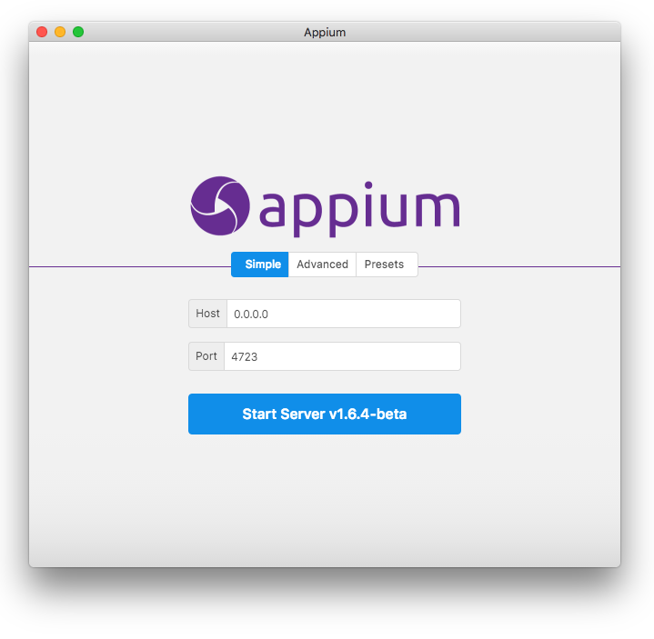
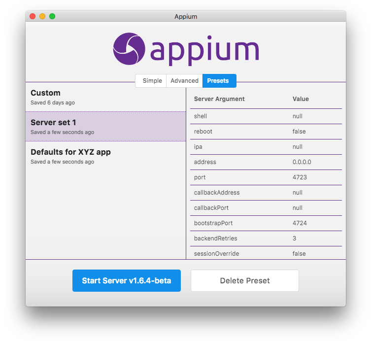
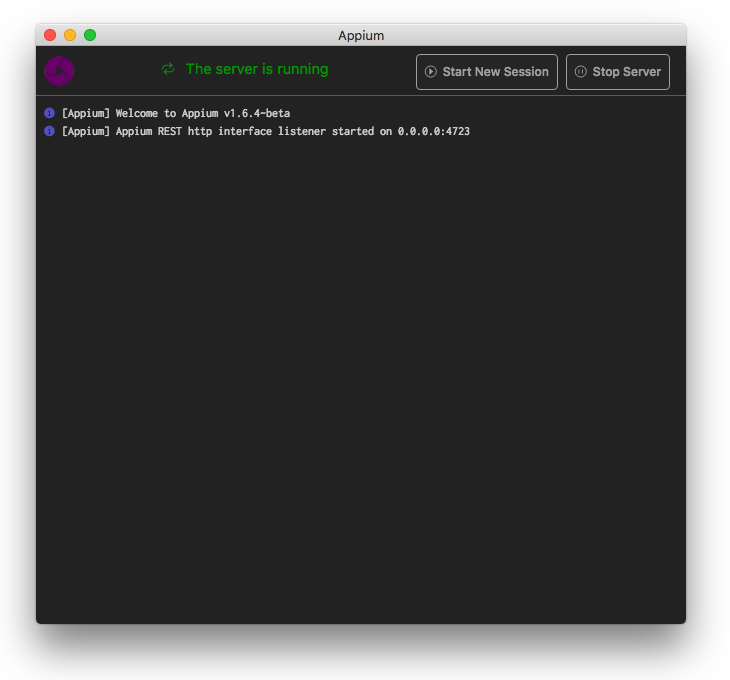

# [DEPRECATED] 
# Please use [Appium Inspector](https://github.com/appium/appium-inspector) and the command line version of [Appium](https://github.com/appium/appium) to inspect elements.

❗❗ This project is no longer maintained since it is not compatible with Appium 2.0+. For Appium 1.x and 2.0+, use the command line Appium server (see the [Appium docs](https://appium.github.io/appium/docs/en/latest/) for installation and setup information), in combination with [Appium Inspector](https://github.com/appium/appium-inspector).

❗❗ Since this project was deprecated at least one security vulnerability was discovered that could allow remote code execution by a malicious party if Appium Desktop's open ports are exposed to the wider internet. This project is unsupported and no fixes are planned. Again, please do not use Appium Desktop anymore. Use Appium and the Appium Inspector instead.

_The old documentation for this project remains below._

# Appium Desktop

Appium Desktop is an app for Mac, Windows, and Linux which gives you the power of the [Appium](http://appium.io) automation server in a beautiful and flexible UI. It is basically a graphical interface for the Appium Server. You can set options, start/stop the server, see logs, etc... You also don't need to use Node/NPM to install Appium, as the Node runtime comes bundled with Appium Desktop.

**Note:** an inspector UI used to be included with Appium Desktop. It is now its own separate app: [Appium Inspector](https://github.com/appium/appium-inspector).

## Download Appium Desktop

You can always pick up the latest release of the Server GUI at our
[Release](https://github.com/appium/appium-desktop/releases/latest) page on
GitHub.

If you're on Windows or macOS, Appium Desktop will automatically provide you
with updated versions of the app when they are released. If you encounter
a problem updating, simply delete or uninstall the app and re-download the
latest from the link above.

Note that Appium Desktop _is not_ the same thing as Appium. Appium Desktop is
a graphical frontend to Appium with additional tools. Appium Desktop is
released on its own cadence and has its own versioning system. If you are
reporting an issue with Appium Desktop, always be sure to include _both_ the
version of Appium Desktop and the version of the Appium Server which is in use
(see below).

If you're on macOS, you will need to install Appium Desktop apps by copying the app
from the downloaded DMG file to your own file system (the best place is the
"Applications" folder). Running Appium from in side the attached DMG itself is
not supported, and will not work.

### Installing on macOS

If you're using the desktop app on macOS, when you run it you may be greeted with some error about
the app not being able to be opened, or not verified by Apple, or something similar. The easiest
way to get around this is to run `xattr -cr` on the file you downloaded. So let's say you
downloaded `Appium-Server-GUI-mac-<version>.dmg` and copy `Appium Server GUI.app` in
`/Applications` inside the disk image. Then you would run `xattr -cr "/Applications/Appium Server
GUI.app"` before opening it. The same goes for the zip version (or the .app itself).

## Known Issues

* Some Windows 10 Users experience a `PathTooLongException` when installing the EXE. The workaround for this is to update the setting on Windows to [enable long paths](https://superuser.com/questions/1119883/windows-10-enable-ntfs-long-paths-policy-option-missing)

## Usage Instructions

These instructions assume you are already familiar with Appium and Appium-related concepts. If you
are new to Appium, please visit [appium.io](http://appium.io) and read our introductory material.
They also assume that you have downloaded both the Server GUI and the Inspector apps.

This app provides a convenient way to download and run the Appium automation
server, as well as a tool for inspecting elements in Chrome/Safari browser and your Android or iOS application. Its
various capabilities are described in the following sections.

#### Starting a simple server

When you open Appium Desktop, you are greeted with the server start window. The
basic option is to start an Appium server with all its defaults and the ability
to modify the host and port. The start button will also let you know which
version of the Appium server you are running, which can be useful when
reporting issues to the Appium team.

#### Starting a server with advanced options

By clicking on the 'Advanced' tab, you have the ability to set all the server
flags that are available in Appium. This is for advanced users and should only
be modified after consulting the Appium documentation.

#### Server presets

If you use the advanced server options, you have the ability to save
a configuration for later use. Simply save the preset on the 'Advanced' tab,
and you will subsequently be able to recall and start the server with that
configuration from the 'Preset' tab.

### The server console output window

Once you start the server, it will launch on the host and port you specified,
and open a new window displaying the server log output.

This is fairly straightforward and no real interaction is possible, beyond
using the button to stop the server. You can also copy-and-paste the logs from
this window which is useful in reporting Appium issues.

## Reporting Issues and Requesting Features

Appium Desktop is open source, and we use GitHub for issue tracking. Please
simply report issues at our [issue
tracker](https://github.com/appium/appium-desktop/issues). We will endeavor to
determine whether the issue you are reporting is related to Appium Desktop or
Appium Server. If it's not related to Appium Desktop specifically, we will
close the issue and ask you to open a general Appium issue at [Appium's main
issue tracker](https://github.com/appium/appium/issues). Please, save
yourselves and us valuable time by getting clear on whether the issue you're
experiencing is related to Appium Desktop specifically or instead is a general
Appium issue. You can do this by seeing whether the issue reproduces with the
Appium command line server as well. If it does, direct your report to Appium's
issue tracker.

Have a feature request? Follow the same process and submit an issue to the
appropriate tracker! (Either here in this repo if the request is specifically
for Appium Desktop, or Appium's main tracker if the request is for Appium more
generally.)

## Advanced Topics and Troubleshooting

#### Appium can't detect environment variables on Mac

Appium uses environment variables like `ANDROID_HOME` as well as relying on
various binaries in your `PATH` and so on. When running from the command line
in an environment where you have set these variables appropriately, Appium has
no problem in picking them up. However, Appium Desktop does not run in a shell
or a command-line environment, and so by default it does not have access to
environment variables you have set in your shell startup script or profile. To
work around this, we use the
[shell-env](https://github.com/sindresorhus/shell-env) package to pick up
environment variables defined in your shell. This package only looks in certain
common init scripts, however, like `~/.bashrc`, `~/.bash_profile`, and
`~/.zshrc`. If you set your Appium environment variables in some other way, you
will need to create one of these default init scripts and set your environment
variables there as well, so that Appium Desktop will successfully pick them up.

#### Warnings about being on a read-only file system

This probably means you tried to launch Appium Desktop from the downloaded disk
image (`.dmg` file). This is not a supported mode of running Appium Desktop. To
correctly install Appium Desktop, copy the application from the disk image to
your local filesystem, to somewhere like `/Applications`. Then, run the app
from that new location.

## Developer Instructions

Want to hack on Appium Desktop? Awesome! Head on over to our [Contributing
Doc](CONTRIBUTING.md) for information on how to get a dev environment set up
and submit changes back to the project.
