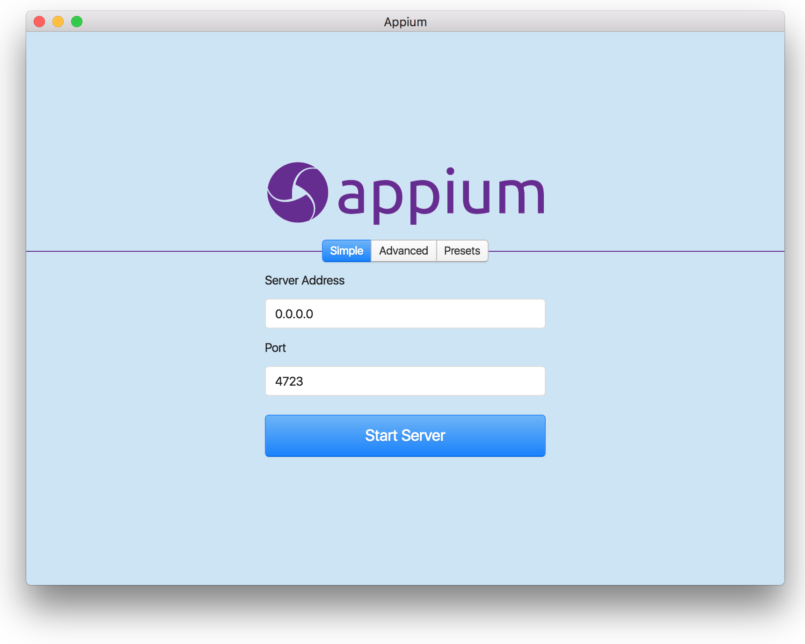
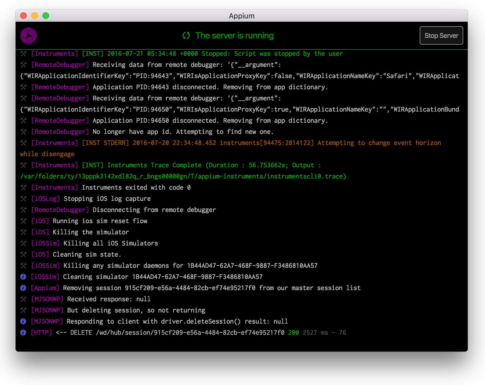

# Appium Desktop [](https://travis-ci.org/appium/appium-desktop) [](https://ci.appveyor.com/project/appium/appium-desktop-9xjtw)

Appium Desktop is an app for Mac, Windows, and Linux which gives you the power of the [Appium](http://appium.io) automation server in a beautiful and flexible UI. It is a combination of a few Appium-related tools:

* A graphical interface for the Appium Server. You can set options, start/stop the server, see logs, etc... You also don't need to use Node/NPM to install Appium, as the Node runtime comes bundled with Appium Desktop.
* An Inspector that you can use to look at your app's elements, get basic information about them, and perform basic interactions with them. This is useful as a way to learn about Appium or as a way to learn about your app so you can write tests for it.

**This is a work in progress!**

## Screenshots

#### Start an Appium server



#### Follow Appium logs



## Instructions for Users

There are not currently any releases of Appium Desktop available for users. If you want to play with it, you will need to build it from source following the directions for developers below.

## Instructions for Developers

### Overview

Appium Desktop is an [Electron](http://electron.atom.io) app. Electron apps have a basic architecture that consists of a _main_ process (which runs Node.js) and possibly many _renderer_ processes (essentially browser windows which display HTML/CSS and can run JS---this is where the UI lives). Interactions between the two types of process are made possible by a built-in interprocess communication (IPC) mechanism.

For the UI, Appium Desktop is built using [React](https://facebook.github.io/react/) and [Redux](http://redux.js.org) for managing UI state and interactions, with [Ant Design](https://ant.design/docs/react/introduce) for various UI components.

Why did we decide to go this route?

* Electron bundles apps for any platform
* Appium is written in JS so it's a nice way to stick with that as the main language; we can rely on Appium's community to maintain this app and follow Appium's coding standards
* Using web technologies to build a UI is a skill that many people have, whereas building native UIs is more esoteric
* Because Electron's main process runs in Node, we can import Appium as a strict dependency rather than be forced to manage it as a subprocess. This is great for speed and error handling
* It's fun!

Credits where credit is due: for the project's tooling, we started with [electron-react-boilerplate](https://github.com/chentsulin/electron-react-boilerplate), which comes with an excellent set of helpers scripts, many of which we still use in an unmodified fashion. Many thanks to that project!

### Setting up

0. Clone the repo
0. Install dependencies (`npm install`)

NB: the app currently does not work with the dependencies installed this way. This is because we rely on a version of Appium which has not yet been published. To work around this, after you `npm install`, simply pull down Appium master in another repository, install its dependencies, run `npm link` in that repo, then come back to Appium Desktop's repo and run `npm link appium`. This will overwrite the version of Appium that we use with the development version that works.

### Doing Development

There is a handy script for preparing the code and launching a development version of the app:

```bash
npm run dev
```

This launches both the app and a development server which feeds UI code changes to the app as you make them (this is called 'hot reload'). In most cases, if you're simply making UI changes, you won't need to relaunch the app in order to see them reflected. If you do, simply kill this script and start again.

Another important thing to do before committing is to run a lint tool on your code:

```bash
npm run lint
```

Finally, you might want to run the app in a non-development mode in order to make sure that everything works as expected if you were to publish:

```bash
npm run build  # prepare resources
npm start  # start a production version of the app
```

### Packaging and Releasing

To package the app for your platform, run:

```bash
npm run package
```

To package the app for _all_ platforms, run:

```bash
npm run package-all
```

This will build the apps with the latest version of electron and put the various app packages in `release/`.

```bash
npm version <VERSION_TYPE>
```

This will increment the version and push a new tag. This will trigger AppVeyor and Travis CI to run a CI
build process and then publish the assets (.dmg, .exe, .AppImage) to GitHub releases which will contain a
draft of the new release.

Appium Desktop follows the same npm versioning workflow but isn't published to NPM.

Travis CI dashboard: https://travis-ci.org/appium/appium-desktop/
AppVeyor dashboard: https://ci.appveyor.com/project/appium/appium-desktop
